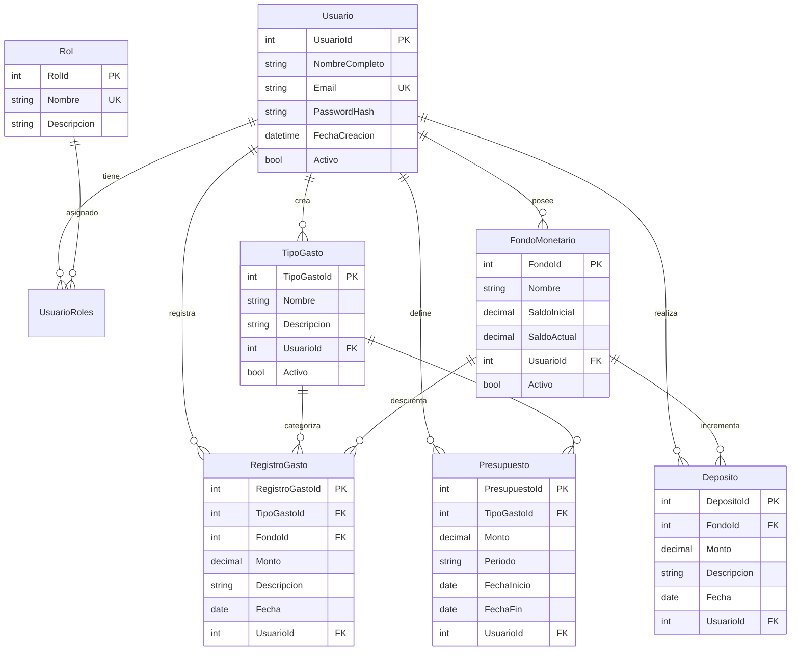

# 💰 Sistema de Control de Gastos

[](https://dotnet.microsoft.com/)
[](https://angular.io/)
[](https://www.postgresql.org/)
[](LICENSE)

Sistema web completo para el control y gestión de gastos personales, desarrollado con .NET 8.0, Angular 17 y PostgreSQL. Permite a los usuarios registrar gastos, administrar presupuestos, gestionar fondos monetarios y generar reportes detallados.

> **🚀 Estado del Deployment:** Backend desplegado en Railway | [Ver guía de configuración →](CONFIGURACION_SUPABASE_RAILWAY.md)


## ✨ Características

### 🔐 Autenticación y Autorización

- Sistema de login y registro de usuarios
- Autenticación mediante JWT (JSON Web Tokens)
- Roles de usuario: Administrador y Usuario estándar
- Gestión de sesiones y tokens con expiración configurable

### 📊 Gestión de Gastos

- **Tipos de Gasto**: Crea y administra categorías personalizadas
- **Registro de Gastos**: Registra gastos con fecha, monto, descripción y categoría
- **Validación de Presupuesto**: Alertas automáticas al exceder presupuestos
- **Fondos Monetarios**: Gestiona múltiples cuentas o fondos
- **Depósitos**: Registra ingresos a tus fondos

### 💼 Presupuestos

- Definición de presupuestos por categoría de gasto
- Seguimiento de presupuestos mensuales
- Comparativa entre presupuesto asignado vs. gasto real
- Alertas visuales de sobregasto

### 📈 Reportes y Análisis

- **Consulta de Movimientos**: Filtros por rango de fechas
- **Gráficos Comparativos**: Visualización de gastos vs. presupuestos
- **Exportación de Datos**: Descarga reportes en formato CSV/Excel
- **Dashboard Interactivo**: Resumen general de tu situación financiera

### 👨‍💼 Panel de Administración

- Gestión de usuarios del sistema
- Activación/desactivación de usuarios
- Cambio de roles y permisos
- Estadísticas globales del sistema
- Reportes administrativos

## 🚀 Tecnologías

### Backend

- **.NET 8.0**: Framework principal
- **ASP.NET Core Web API**: API RESTful
- **Entity Framework Core 8.0**: ORM para PostgreSQL
- **Npgsql.EntityFrameworkCore.PostgreSQL**: Provider de PostgreSQL
- **JWT Bearer Authentication**: Seguridad y autenticación
- **Swagger/OpenAPI**: Documentación de API

### Frontend

- **Angular 17**: Framework SPA
- **TypeScript 5.2**: Tipado fuerte
- **RxJS**: Programación reactiva
- **Angular Router**: Navegación SPA
- **HTTP Client**: Comunicación con API

### Base de Datos

- **PostgreSQL 15+**: Base de datos relacional
- **Triggers y Functions**: Lógica de negocio en BD
- **Índices optimizados**: Alto rendimiento

### DevOps y Despliegue

- **Supabase**: Hosting de base de datos PostgreSQL (Free Tier)
- **Railway**: Hosting del backend .NET (Free Tier)
- **Vercel**: Hosting del frontend Angular (Free Tier)
- **Git/GitHub**: Control de versiones

## 📋 Requisitos Previos

### Para desarrollo local

- [.NET SDK 8.0](https://dotnet.microsoft.com/download/dotnet/8.0) o superior
- [Node.js 18.x](https://nodejs.org/) o superior
- [PostgreSQL 15+](https://www.postgresql.org/download/) (o cuenta en Supabase)
- [Angular CLI 17](https://angular.io/cli)
- [Git](https://git-scm.com/)

### Para deployment en producción

- Cuenta en [Supabase](https://supabase.com) (Base de datos - Free)
- Cuenta en [Railway](https://railway.app) (Backend - Free)
- Cuenta en [Vercel](https://vercel.com) (Frontend - Free)

## 🛠️ Instalación y Configuración Local

### 1. Clonar el repositorio

```bash
git clone https://github.com/tu-usuario/control-gastos.git
cd control-gastos
```

### 2. Configurar la Base de Datos

#### Opción A: PostgreSQL Local

```bash
# Crear la base de datos
createdb ControlGastosDB

# Ejecutar el script SQL
psql -d ControlGastosDB -f Database/supabase-schema.sql
```

#### Opción B: Supabase (Recomendado)

1. Crea una cuenta gratuita en [Supabase](https://supabase.com)
2. Crea un nuevo proyecto
3. Ve a SQL Editor y ejecuta el script `Database/supabase-schema.sql`
4. Copia tu Connection String desde Settings → Database

### 3. Configurar el Backend

```bash
cd Backend/ControlGastos.API

# Restaurar paquetes NuGet
dotnet restore

# Configurar appsettings.json
# Edita el archivo y actualiza:
# - ConnectionStrings:DefaultConnection
# - Jwt:Key (genera una clave segura de 32+ caracteres)

# Ejecutar migraciones (si es necesario)
dotnet ef database update

# Iniciar el servidor
dotnet run
```

El backend estará disponible en: `http://localhost:5000`
Swagger UI: `http://localhost:5000/swagger`

### 4. Configurar el Frontend

```bash
cd Frontend/control-gastos-app

# Instalar dependencias
npm install

# Configurar environment (ya está configurado por defecto)
# El archivo src/environments/environment.ts ya apunta a localhost:5000

# Iniciar el servidor de desarrollo
npm start
```

El frontend estará disponible en: `http://localhost:4200`

### 5. Credenciales por defecto

```text
Email: admin@example.com
Password: Admin123!
```

> ⚠️ **IMPORTANTE**: Cambia estas credenciales inmediatamente después del primer login.

## 🌐 Despliegue en Producción

Para desplegar la aplicación de forma **100% GRATUITA** en la nube, sigue las guías detalladas:

### 📚 Documentación de Deployment

- 🚀 **[Guía Paso a Paso - Supabase + Railway](CONFIGURACION_SUPABASE_RAILWAY.md)** ← RECOMENDADO
- 📋 **[Pasos Inmediatos](PASOS_INMEDIATOS.md)** - Quick reference
- 📊 **[Estado Actual del Proyecto](ESTADO_ACTUAL.md)** - Qué está hecho y qué falta
- 📖 **[Instrucciones Completas](INSTRUCCIONES_DESPLIEGUE.md)** - Guía general

### Resumen de despliegue

1. **Base de Datos**: Supabase (PostgreSQL gratuito)
2. **Backend API**: Railway (500 horas/mes gratis) - ✅ **YA DESPLEGADO**
3. **Frontend**: Vercel (deployments ilimitados gratis) - ⏳ **Pendiente configurar**

**Tiempo estimado restante**: 15-20 minutos (solo configuración de variables)

## 📁 Estructura del Proyecto

```text
control-gastos/
├── Backend/
│   └── ControlGastos.API/
│       ├── Controllers/          # Controladores de la API
│       ├── Data/                 # DbContext y configuración EF
│       ├── Models/               # Modelos de datos
│       ├── Services/             # Lógica de negocio
│       ├── Program.cs            # Configuración principal
│       └── appsettings.json      # Configuración de la app
│
├── Frontend/
│   └── control-gastos-app/
│       ├── src/
│       │   ├── app/
│       │   │   ├── components/   # Componentes Angular
│       │   │   ├── models/       # Interfaces TypeScript
│       │   │   ├── services/     # Servicios HTTP
│       │   │   ├── guards/       # Guards de autenticación
│       │   │   └── interceptors/ # Interceptores HTTP
│       │   └── environments/     # Configuración por ambiente
│       └── package.json
│
├── Database/
│   └── supabase-schema.sql              # Script SQL de la BD
│
├── scripts/
│   ├── cleanup-before-commit.ps1        # Limpieza de archivos
│   ├── verify-railway-ready.ps1         # Verificación pre-deploy
│   └── generar-jwt-key.ps1              # Generador de clave JWT
│
├── Dockerfile                            # Docker para Railway
├── .railway.toml                         # Configuración Railway
├── nixpacks.toml                         # Config alternativa Railway
├── vercel.json                           # Configuración Vercel
├── CONFIGURACION_SUPABASE_RAILWAY.md    # 🚀 Guía paso a paso
├── PASOS_INMEDIATOS.md                  # Quick reference
├── ESTADO_ACTUAL.md                     # Estado del proyecto
├── INSTRUCCIONES_DESPLIEGUE.md          # Guía general
├── CAMBIOS_REALIZADOS.md                # Documentación técnica
├── CONTRIBUTING.md                      # Guía de contribución
├── LICENSE                              # Licencia MIT
└── README.md                            # Este archivo
```

## 🔌 API Endpoints

### Autenticación (`/api/auth`)

```http
POST   /api/auth/registro          # Registrar nuevo usuario
POST   /api/auth/login             # Iniciar sesión
GET    /api/auth/perfil            # Obtener perfil del usuario
PUT    /api/auth/cambiar-password  # Cambiar contraseña
GET    /api/auth/verificar-token   # Verificar validez del token
```

### Tipos de Gasto (`/api/TipoGasto`)

```http
GET    /api/TipoGasto              # Listar todos los tipos
GET    /api/TipoGasto/{id}         # Obtener por ID
GET    /api/TipoGasto/siguiente-codigo # Obtener siguiente código
POST   /api/TipoGasto              # Crear nuevo tipo
PUT    /api/TipoGasto/{id}         # Actualizar tipo
DELETE /api/TipoGasto/{id}         # Eliminar tipo
```

### Fondos Monetarios (`/api/FondoMonetario`)

```http
GET    /api/FondoMonetario         # Listar todos los fondos
GET    /api/FondoMonetario/{id}    # Obtener por ID
POST   /api/FondoMonetario         # Crear nuevo fondo
PUT    /api/FondoMonetario/{id}    # Actualizar fondo
DELETE /api/FondoMonetario/{id}    # Eliminar fondo
```

### Presupuestos (`/api/Presupuesto`)

```http
GET    /api/Presupuesto            # Listar todos los presupuestos
GET    /api/Presupuesto/{id}       # Obtener por ID
GET    /api/Presupuesto/mes/{mes}/anio/{anio} # Presupuestos por mes
POST   /api/Presupuesto            # Crear presupuesto
PUT    /api/Presupuesto/{id}       # Actualizar presupuesto
DELETE /api/Presupuesto/{id}       # Eliminar presupuesto
```

### Registro de Gastos (`/api/RegistroGasto`)

```http
GET    /api/RegistroGasto          # Listar todos los gastos
GET    /api/RegistroGasto/{id}     # Obtener por ID
POST   /api/RegistroGasto/validar  # Validar presupuesto antes de crear
POST   /api/RegistroGasto          # Crear nuevo gasto
DELETE /api/RegistroGasto/{id}     # Eliminar gasto
```

### Depósitos (`/api/Deposito`)

```http
GET    /api/Deposito               # Listar todos los depósitos
GET    /api/Deposito/{id}          # Obtener por ID
POST   /api/Deposito               # Crear nuevo depósito
PUT    /api/Deposito/{id}          # Actualizar depósito
DELETE /api/Deposito/{id}          # Eliminar depósito
```

### Reportes (`/api/Reporte`)

```http
GET    /api/Reporte/movimientos?fechaInicio={inicio}&fechaFin={fin}
       # Obtener movimientos por rango de fechas

GET    /api/Reporte/comparativo-presupuesto?fechaInicio={inicio}&fechaFin={fin}
       # Comparativo de gastos vs. presupuesto
```

### Usuarios - Admin (`/api/usuario`)

```http
GET    /api/usuario                # Listar todos los usuarios
GET    /api/usuario/{id}           # Obtener usuario por ID
PUT    /api/usuario/{id}           # Actualizar usuario
PUT    /api/usuario/{id}/activar   # Activar usuario
PUT    /api/usuario/{id}/desactivar # Desactivar usuario
PUT    /api/usuario/{id}/cambiar-rol # Cambiar rol
GET    /api/usuario/estadisticas   # Estadísticas de usuarios
DELETE /api/usuario/{id}           # Eliminar usuario
```

> 📖 **Documentación completa de la API**: Disponible en `/swagger` cuando ejecutes el backend.

## 🧪 Testing

### Testing Backend

```bash
cd Backend/ControlGastos.API
dotnet test
```

### Testing Frontend

```bash
cd Frontend/control-gastos-app
npm test
```

## 🔒 Seguridad

- ✅ Autenticación JWT con tokens seguros
- ✅ Passwords hasheados con SHA256 (considerar BCrypt para producción)
- ✅ Validación de entrada en todos los endpoints
- ✅ Autorización basada en roles
- ✅ CORS configurado correctamente
- ✅ HTTPS obligatorio en producción
- ✅ Variables de entorno para datos sensibles

### Recomendaciones adicionales

- Implementar rate limiting
- Agregar logging centralizado
- Configurar políticas de contraseñas más estrictas
- Implementar autenticación de dos factores (2FA)
- Realizar auditorías de seguridad periódicas

## 📊 Modelo de Datos



## 🤝 Contribuir

Las contribuciones son bienvenidas! Si deseas contribuir:

1. Fork el proyecto
2. Crea una rama para tu feature (`git checkout -b feature/AmazingFeature`)
3. Commit tus cambios (`git commit -m 'Add some AmazingFeature'`)
4. Push a la rama (`git push origin feature/AmazingFeature`)
5. Abre un Pull Request

### Guías de contribución

- Sigue las convenciones de código existentes
- Escribe tests para nuevas funcionalidades
- Actualiza la documentación según sea necesario
- Asegúrate de que todos los tests pasen antes de hacer PR

## 🐛 Reportar Bugs

Si encuentras un bug, por favor [abre un issue](https://github.com/tu-usuario/control-gastos/issues) con:

- Descripción detallada del problema
- Pasos para reproducir
- Comportamiento esperado vs. actual
- Screenshots si es relevante
- Versiones de software (OS, navegador, etc.)

## 📝 Roadmap

### Versión 2.0 (Planificada)

- [ ] Exportación de reportes a PDF
- [ ] Gráficos avanzados con Chart.js
- [ ] Notificaciones push
- [ ] Aplicación móvil (Flutter/React Native)
- [ ] Sincronización con bancos mediante APIs
- [ ] Modo oscuro
- [ ] Multi-idioma (i18n)
- [ ] Importación de gastos desde CSV/Excel
- [ ] Categorías compartidas entre usuarios
- [ ] Metas de ahorro

### Versión 1.1 (En desarrollo)

- [ ] Recordatorios de pagos recurrentes
- [ ] Dashboard mejorado con más widgets
- [ ] Filtros avanzados en reportes
- [ ] Autenticación con Google/Facebook
- [ ] Backup automático de datos

## 📄 Licencia

Este proyecto está bajo la Licencia MIT. Ver el archivo [LICENSE](LICENSE) para más detalles.

```text
MIT License

Copyright (c) 2024 [Tu Nombre]

Permission is hereby granted, free of charge, to any person obtaining a copy
of this software and associated documentation files (the "Software"), to deal
in the Software without restriction...
```

## 👥 Autores

- **[Tu Nombre]** - *Desarrollo inicial* - [@tu-usuario](https://github.com/tu-usuario)

Ver también la lista de [contribuidores](https://github.com/tu-usuario/control-gastos/contributors) que participaron en este proyecto.

## 🙏 Agradecimientos

- Inspirado en herramientas como Mint, YNAB y Wallet
- Gracias a la comunidad de .NET y Angular
- Iconos por [Font Awesome](https://fontawesome.com/)
- Imágenes de ejemplo por [Unsplash](https://unsplash.com/)

## 📞 Contacto

**Email**: <tu-email@example.com>
**LinkedIn**: [Tu Perfil](https://linkedin.com/in/tu-perfil)
**Twitter**: [@tu-usuario](https://twitter.com/tu-usuario)

**Link del Proyecto**: [https://github.com/tu-usuario/control-gastos](https://github.com/tu-usuario/control-gastos)

---

⭐️ Si este proyecto te fue útil, considera darle una estrella en GitHub!

## Hecho con ❤️ usando .NET y Angular
